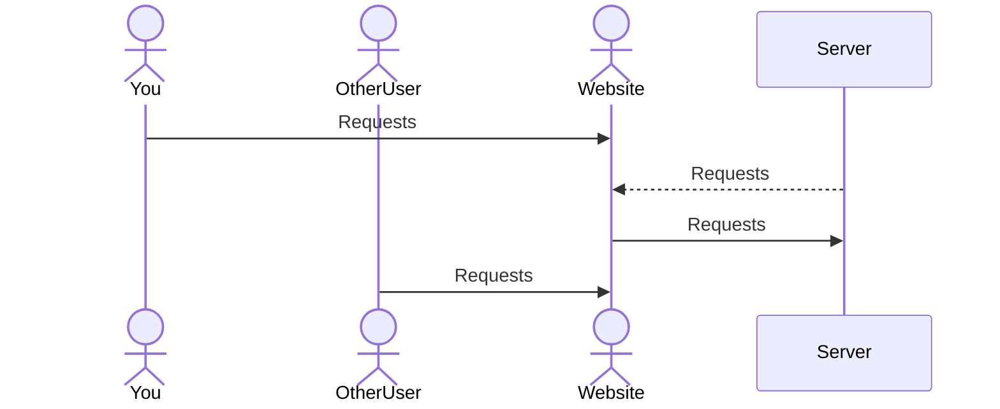

# BelayOn

[My Notes](notes.md)

An application to keep track of your gym's members to keep climbers climbing and staff moving.

## 🚀 Specification Deliverable

For this deliverable I did the following. I checked the box `[x]` and added a description for things I completed.

- [x] Proper use of Markdown
- [x] A concise and compelling elevator pitch
- [x] Description of key features
- [x] Description of how you will use each technology
- [x] One or more rough sketches of your application. Images must be embedded in this file using Markdown image references.

### Elevator pitch

As climbing moves to the forefront of sports, the demand for climbing gyms has increased dramatically. With more and more climbers moving indoors the systems of yesterday to track and manage guest and members are no longer adequet. BelayOn solves these problems by using modern web tools and techniques to help you manage your gym more effectively, allowing your climbers a seamless transition from guest to member. Improved productivity for your staff also allows them to focus more on customer relations, facilities managment, safety, and instruction overall improving the quality of life for everyone in the gym. 

### Design

First page will be a login page, allowing employees access to the system. Logging in will pull up the list of all guests and members with some information about each. Clicking on a name will pull up a small window with more detailed information and the ability to view their membership status and notes. All of these will have buttons and options to edit on the fly.

### Key features

- One-Click Member: Allow easy transition from Guest to Member in 1 click.
- Robust Notes: Ability to add notes to account and view deleted notes to keep staff aware of context with accounts.
- Linked Accounts: Families are easily accessed and modified together, rather than needing to edit each account separately.
- Checkout System: Prevent mix ups by making sure only 1 staff member can modify an account at a time.

### Technologies

I am going to use the required technologies in the following ways.

- **HTML** - Provide a structure to the website ensuring users can find what they need. Two pages, one for logging in and one for displaying the guests and members. A smaller popup window will be needed to display more info of the guests.
- **CSS** - By creating a smooth workflow through efficient and pleasing to look at site. Scaling on different screen sizes, using smoother edges and bright colors will allow for a modern sleek design.
- **React** - React will make the webpage interactable for users to login, make edits to accounts, show other users working on accounts, and showing the list of guests/members.
- **Service** - Allow users to access accounts from anywhere. Retrieves member's and guest's data, edits from the user to be saved, current editing from other users, logging in and signing up, and retreiving motivation quotes from [ZenQuotes](https://zenquotes.io?api=today)
- **DB/Login** - Ensure only certified users can make edits to the system and store guest and member accounts/details.
- **WebSocket** - Prevent users from editing the same account and overriding eachother's work. Shows which accounts are locked because other users are currently editing them.

## 🚀 AWS deliverable

For this deliverable I did the following. I checked the box `[x]` and added a description for things I completed.

- [x] **Server deployed and accessible with custom domain name** - [My server link](https://onbelay.click).

## 🚀 HTML deliverable

For this deliverable I did the following. I checked the box `[x]` and added a description for things I completed.

- [x] **HTML pages** - 5 pages: index.html (login), database.html (for searching up accounts), entrylookup.html (for viewing/editing an account), createaccount.html (for new accounts), and about.html (short description of the software).
- [x] **Proper HTML element usage** - I used several elements including nav, header, footer, form, paragraphs, table, buttons, and inputs.
- [x] **Links** - Each page can be accessed from the others through the links at the top of the page.
- [x] **Text** - Each page includes the name of the page and simple instructions as well as the about page has tons.
- [x] **3rd party API placeholder** - On the about page there is a spot for motivational quotes that I intend to source from a website.
- [x] **Images** - I including a motivational image of Adam Ondra climbing the route Silence on the about page.
- [x] **Login placeholder** - index.html includes the login process.
- [x] **DB data placeholder** - On the database page there is a placeholder table which will be loaded with the guests details.
- [x] **WebSocket placeholder** - Included next to guest/members names is the placeholder for the names of staff members working on accounts.

## 🚀 CSS deliverable

For this deliverable I did the following. I checked the box `[x]` and added a description for things I completed.

- [x] **Visually appealing colors and layout. No overflowing elements.** - I aligned elements in a pleasing manner and used color to provide the page with a pleasing asthetic. Added overflow protection to database lists.
- [x] **Use of a CSS framework** - I used Bootstrap for modeling buttons, forms, and inputs.
- [x] **All visual elements styled using CSS** - I styled all elements such as buttons, inputs, forms, and images.
- [x] **Responsive to window resizing using flexbox and/or grid display** - I used flexbox for elements in rows like likes and grid for elements in the database grid.
- [x] **Use of a imported font** - I imported the SN Pro, Sans-Serif font from google.
- [x] **Use of different types of selectors including element, class, ID, and pseudo selectors** - I used elements, classes, ids, and pseudo selectors in my css.

## 🚀 React part 1: Routing deliverable

For this deliverable I did the following. I checked the box `[x]` and added a description for things I completed.

- [x] **Bundled using Vite** - I bundled my code using Vite.
- [x] **Components** - I made sure all of my components were correctly set up.
- [x] **Router** - My website only uses one page and routes each sub page.

## 🚀 React part 2: Reactivity deliverable

For this deliverable I did the following. I checked the box `[x]` and added a description for things I completed.

- [x] **All functionality implemented or mocked out** - Users can now sign up and login. Users can add customers to the database/local storage. Users can checkout customer accounts and update their content which is saved to local storage. Users can see when others checkout or check in accounts.
- [x] **Hooks** - Used useState hooks for variables that changed the rendering of the page like the database. I also implemented useEffect for when events needed to happen in time or only once.

## 🚀 Service deliverable

For this deliverable I did the following. I checked the box `[x]` and added a description for things I completed.

- [x] **Node.js/Express HTTP service** - Backend server handles HTTP requests and responses using Node.js.
- [x] **Static middleware for frontend** - Middleware grabs json, static files, and cookies for ease of use.
- [x] **Calls to third party endpoints** - Calls to adviceslip to get a quote.
- [x] **Backend service endpoints** - Endpoints for register, login, getting database, getting user, saving user, checking in/out user.
- [x] **Frontend calls service endpoints** - Front end makes all calls to service endpoints (except third party).
- [x] **Supports registration, login, logout, and restricted endpoint** - All supported!

## 🚀 DB deliverable

For this deliverable I did the following. I checked the box `[x]` and added a description for things I completed.

- [x] **Stores data in MongoDB** - I am storing customer accounts in mongo.
- [x] **Stores credentials in MongoDB** - I am storing staff/user credentials in mongo.

## 🚀 WebSocket deliverable

For this deliverable I did the following. I checked the box `[x]` and added a description for things I completed.

- [x] **Backend listens for WebSocket connection** - Backend is set up and listens for WebSocket connections and pings.
- [x] **Frontend makes WebSocket connection** - Front end makes a websocket connection.
- [x] **Data sent over WebSocket connection** - Front end sends check in/out messages to notify other users which accounts they are editing. Aditionally, messages are sent for creating accounts.
- [x] **WebSocket data displayed** - On the database page, websocket data is displayed when a user checks in/out or creates an account.
- [x] **Application is fully functional** - Yep! It works.
